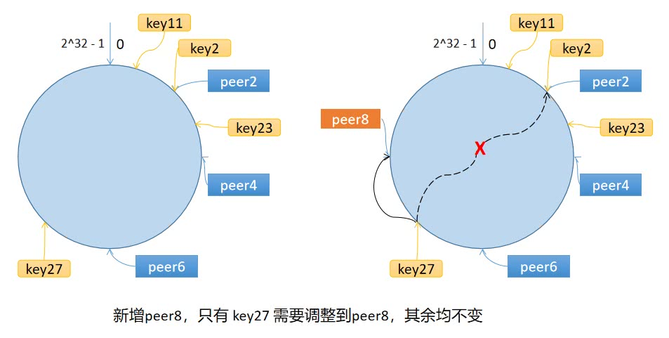

## geeccahe
一个简单的分布式缓存系统
- 支持的特性有
- 单机缓存和基于 HTTP 的分布式缓存
- 最近最少访问(Least Recently Used, LRU) 缓存策略
- 使用 Go 锁机制防止缓存击穿
- 使用一致性哈希选择节点，实现负载均衡
- 使用 protobuf 优化节点间二进制通信

### LRU 缓存淘汰策略
- 如果数据最近被访问过，那么将来被访问的概率也会更高。LRU 算法的实现非常简单，维护一个队列，如果某条记录被访问了，则移动到队尾，那么队首则是最近最少访问的数据，淘汰该条记录即可

### 单机并发缓存
- 通过`sync.Mutex`互斥锁的使用，实现LRU缓存的并发控制
- 实现`GeeCache`核心数据结构Group，缓存不存在时，调用回调函数获取源数据

### HTTP服务端
- 基于`HTTP`的通信机制分布式缓存需要实现节点间通信

### 一致性哈希
- 为了解决分布式缓存中节点动态变化的问题，引入了一致性哈希算法，例如：移除了其中一台节点，只剩下9个，那么之前hash(key)%10变成了hash(key)%9，也就意味着几乎缓存值对应的节点都发生了改变。即几乎所有的缓存值都失效了。节点在接收到对应的请求时，均需要重新去数据源获取数据，容易引起缓存雪崩
- 一致性哈希算法将 key 映射到 2^32 的空间中，将这个数字首尾相连，形成一个环
-
- 数据倾斜问题：很多key都对应一个节点，导致节点压力过大，缓存节点间负载不均
- 引入虚拟节点，将一个物理节点拆分为多个虚拟节点，这样就可以将key均匀分布到多个节点上，从而避免数据倾斜问题

### 分布式节点
- 注册节点，借助一致性哈希算法选择节点
- 实现HTTP客户端，与远程节点的服务端通信     
```
                            是
接收 key --> 检查是否被缓存 -----> 返回缓存值 ⑴
                |  否                         是
                |-----> 是否应当从远程节点获取 -----> 与远程节点交互 --> 返回缓存值 ⑵
                            |  否
                            |-----> 调用`回调函数`，获取值并添加到缓存 --> 返回缓存值 ⑶

```            

- 进一步细化
```

使用一致性哈希选择节点        是                                    是
    |-----> 是否是远程节点 -----> HTTP 客户端访问远程节点 --> 成功？-----> 服务端返回返回值
                    |  否                                    ↓  否
                    |----------------------------> 回退到本地节点处理。

```

### 防止缓存击穿
- geecache实现了一个名为`singleflight`的package来解决这个问题:要是么多个请求同时去请求同一个key，那么只让第一个请求去请求数据源，其他请求等待第一个请求返回结果即可
